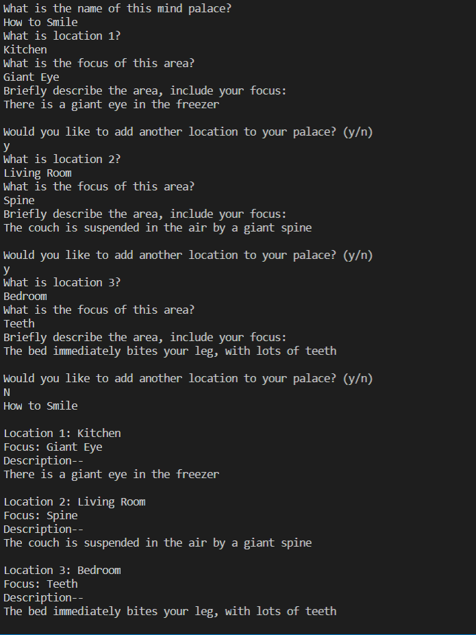

# Overview
This program records mind palaces. Mind palaces are typically stored in the mind, larger ones require some forethought and design. This program fills that purpose. It prints the recorded locations to the screen.   

Potential implementions:
* Location altering
* Printing to files

# Development Environment
* Visual Studio Code  
* Python 3.8.5

# Execution
Ensure that Python is compatible, installed, and enabled.   
Execution of the program: `python memory_walk.py`

# Useful Websites

1. [Python Reference](https://docs.python.org/3/library/index.html)
2. [How to build a mind palace](https://artofmemory.com/wiki/How_to_Build_a_Memory_Palace)